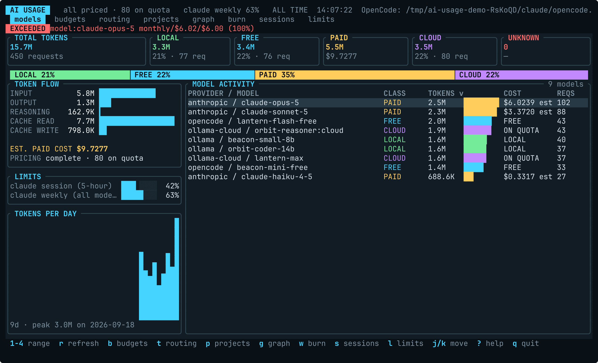
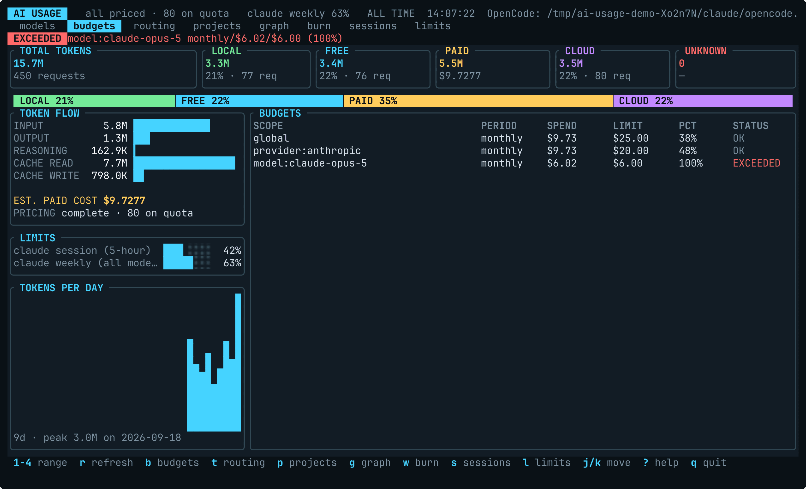
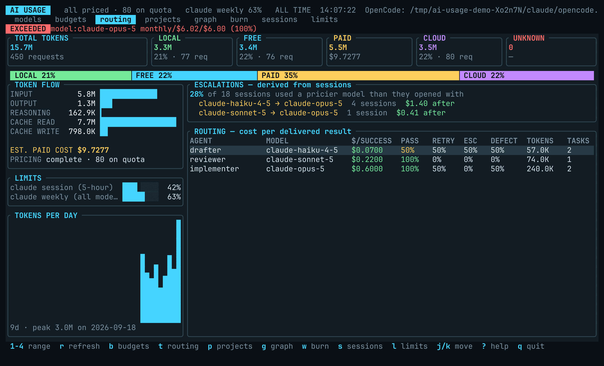
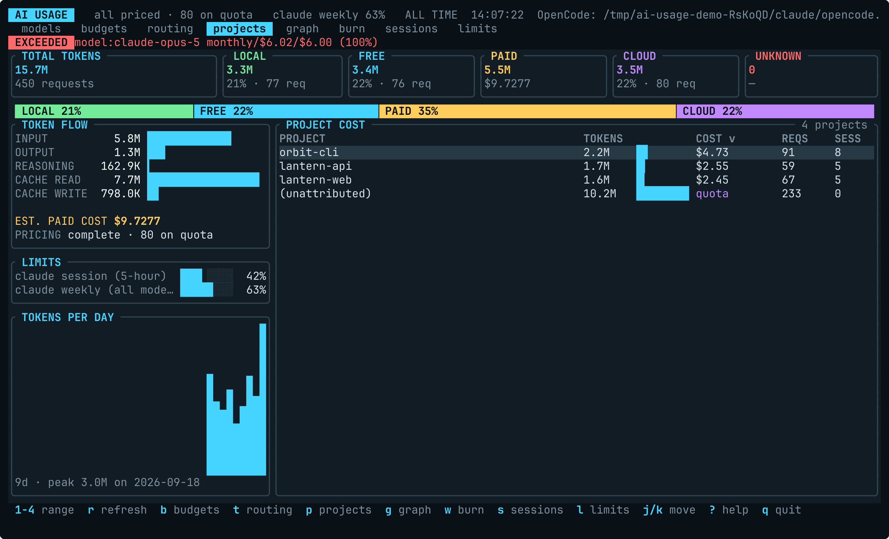
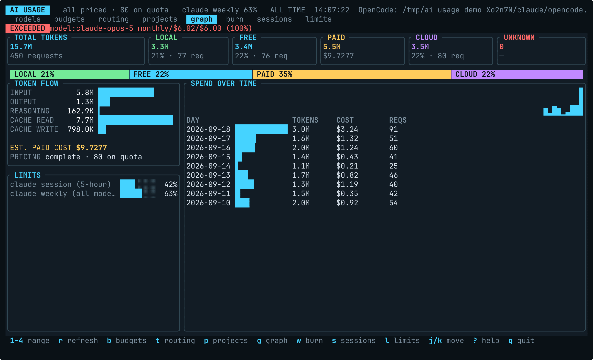
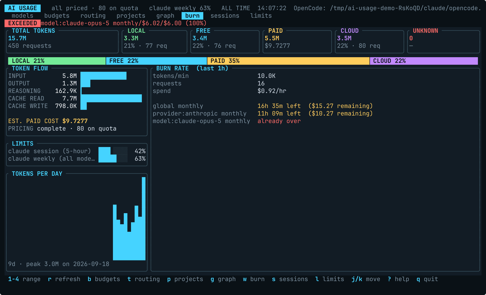
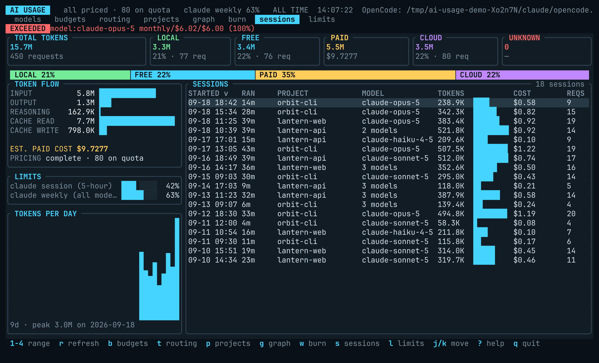

# ai-usage-tui

> A btop-inspired terminal dashboard for AI coding-agent token usage, cost and budgets — reads Claude Code, Codex CLI, Gemini CLI, OpenCode and Ollama, live TUI or JSON/CSV.

[](https://github.com/SophanaSok/ai-usage-tui/actions/workflows/ci.yml)
[](https://github.com/SophanaSok/ai-usage-tui/actions/workflows/release.yml)
[](https://crates.io/crates/ai-usage-tui)
[](LICENSE)

[Quick start](#quick-start) · [Install](#installation) · [Configuration](#configuration) · [Docs](#more-documentation) · [Contributing](CONTRIBUTING.md)

`ai-usage-tui` reads OpenCode's local usage database, Claude Code's session
logs, Codex CLI's session logs and Gemini CLI's telemetry log, can journal
completed Ollama responses, and presents the combined data in an interactive TUI
or as JSON, CSV, or plain text. It tracks requests, input/output/reasoning/cache
tokens, cost provenance, budgets, and opt-in model-routing events.



*Invented demo data, rendered off-screen by `scripts/render-readme-screenshots.sh`. No
real account, project, or spend appears in any image here.*

## Contents

- [What it shows](#what-it-shows)
- [Prerequisites](#prerequisites)
- [Quick start](#quick-start)
- [Installation](#installation)
- [Data sources](#data-sources)
- [Interactive dashboard](#interactive-dashboard)
- [Non-interactive output](#non-interactive-output)
- [Configuration](#configuration)
- [Budget checks](#budget-checks)
- [Model-routing analytics](#model-routing-analytics)
- [CLI reference](#cli-reference)
- [Privacy and network behavior](#privacy-and-network-behavior)
- [Troubleshooting](#troubleshooting)
- [Development](#development)
- [More documentation](#more-documentation)
- [License](#license)

## What it shows

- Usage grouped by provider and model, across OpenCode, Claude Code, Codex CLI, Gemini CLI, and Ollama
- Input, output, reasoning, cache-read, and cache-write tokens
- Today (local calendar day), trailing 7-day, trailing 30-day, all-time, or custom-day ranges
- `LOCAL`, `CLOUD`, `FREE`, `PAID`, and `UNKNOWN` classifications
- Provider-reported, calculated, estimated, free, local, quota-billed, or unavailable cost
- Daily and monthly budget status
- Routing aggregates including retries, escalations, tests, and review defects

Unknown cost is kept unknown rather than displayed as paid usage with a zero
cost. Local and explicitly free usage is excluded from budget spend.

| Category | Meaning |
| --- | --- |
| `LOCAL` | Usage identified as running on a local endpoint |
| `CLOUD` | Hosted or cloud-routed usage without authoritative cost |
| `FREE` | Usage from a model explicitly identified as free |
| `PAID` | Usage from a provider that bills per token — including aggregators and clouds (OpenRouter, Bedrock, Azure, Vertex). Whether a *rate* is known is reported separately, below |
| `UNKNOWN` | Usage whose provider is not recognised as billing per token |

`PAID` is about who bills, not about whether we have a figure. A paid row with no
published rate keeps `cost` as unknown and counts against the pricing-coverage
figure, so the gap is visible rather than hidden in `UNKNOWN`.

Cost status is reported separately from category: `reported` comes from the
provider, `calculated` or `estimated` comes from pricing data, `free` and
`local` are non-billable, and `unavailable` remains unknown.

`quota` is its own case: the usage is billed, but against an account quota or
GPU time rather than per token, so no per-request price exists to report. Ollama
Cloud is one example; Claude Code on a Pro or Max subscription is the other.
For subscription rows the API-list-rate figure is kept as `api_equivalent_cost`
and shown as `API-RATE EQUIV.` in the breakdown, but it is never summed into
cost or budgets. `quota` is deliberately **not** counted as a pricing gap —
doing so reported a correct refusal to invent a number as a failure to produce
one — and deliberately not rendered as `$0.00`. The header shows the volume
alongside the coverage figure so it cannot silently disappear.

## Prerequisites

- **Data:** An OpenCode SQLite database (default:
  `~/.local/share/opencode/opencode.db`), Claude Code session logs under
  `~/.claude/projects`, Codex CLI session logs under `~/.codex`, and/or
  journaled Ollama usage
- **Build (optional):** Stable Rust via [rustup](https://rustup.rs/)
- **Platforms:** Linux and macOS (x86_64 and aarch64) and Windows x86_64 prebuilts from
  [GitHub Releases](https://github.com/SophanaSok/ai-usage-tui/releases)

A missing OpenCode database is not fatal. The dashboard starts with no
OpenCode rows and can still display journaled Ollama usage.

## Quick start

```sh
curl -fsSL https://raw.githubusercontent.com/SophanaSok/ai-usage-tui/main/scripts/install.sh | sh

ai-usage-tui
```

[`scripts/install.sh`](scripts/install.sh) picks the archive for your platform,
**verifies it against the release's published SHA-256 checksums**, and installs
into `~/.local/bin` — `--dir PATH` to choose somewhere else, `--version vX.Y.Z`
to pin a release. It refuses to install anything it could not verify, and names
the source build on a platform with no prebuilt binary.

### Manual download

If you would rather not pipe a script into your shell:

```sh
VERSION=v0.9.0
case "$(uname -s)-$(uname -m)" in
  Linux-x86_64)  SLUG=x86_64-linux   ;;
  Linux-aarch64) SLUG=aarch64-linux  ;;
  Darwin-arm64)  SLUG=aarch64-macos  ;;
  Darwin-x86_64) SLUG=x86_64-macos   ;;
  *) SLUG=""; echo "No prebuilt binary for $(uname -s)-$(uname -m) — build from source instead." ;;
esac

if [ -n "$SLUG" ]; then
  # Unpacked into a scratch directory: the archive also contains README.md and
  # LICENSE, so extracting it in place would overwrite yours.
  TMP="$(mktemp -d)"
  curl -fsSL "https://github.com/SophanaSok/ai-usage-tui/releases/download/${VERSION}/ai-usage-tui-${VERSION}-${SLUG}.tar.gz" \
    | tar xz -C "$TMP"
  mkdir -p ~/.local/bin
  install -m 755 "$TMP/ai-usage-tui" ~/.local/bin/   # or sudo install ... /usr/local/bin/
  rm -rf "$TMP"
fi

ai-usage-tui
```

If the last line reports `command not found`, `~/.local/bin` is not on your
`PATH`; add `export PATH="$HOME/.local/bin:$PATH"` to your shell's rc file.

If OpenCode stores its database elsewhere:

```sh
ai-usage-tui --db /path/to/opencode.db

# Equivalent environment-variable form
OPENCODE_DB_PATH=/path/to/opencode.db ai-usage-tui
```

See [Installation](#installation) for macOS and Windows archives, package
managers, and source builds.

## Installation

### Prebuilt release

Download the archive for your platform from
[GitHub Releases](https://github.com/SophanaSok/ai-usage-tui/releases),
extract it, and place `ai-usage-tui` (or `ai-usage-tui.exe`) on your `PATH`.
Checksums are published with each release.

**Match the archive to your machine's architecture.** Every published binary is verified with
`file` during the release build to confirm it is the architecture its name claims, so an
`x86_64` archive really does contain an x86_64 binary and will not run on Apple Silicon.

| Platform | Archive name pattern |
| --- | --- |
| Linux x86_64 | `ai-usage-tui-VERSION-x86_64-linux.tar.gz` |
| Linux aarch64 | `ai-usage-tui-VERSION-aarch64-linux.tar.gz` |
| macOS Apple Silicon | `ai-usage-tui-VERSION-aarch64-macos.tar.gz` |
| macOS Intel | `ai-usage-tui-VERSION-x86_64-macos.tar.gz` |
| Windows x86_64 | `ai-usage-tui-VERSION-x86_64-windows.zip` |
| Debian/Ubuntu | `ai-usage-tui-VERSION-amd64.deb`, `-arm64.deb` |
| Fedora/RHEL | `ai-usage-tui-VERSION-amd64.rpm`, `-arm64.rpm` |

macOS example (Apple Silicon — use `x86_64-macos` on an Intel Mac):

```sh
VERSION=v0.9.0
TMP="$(mktemp -d)"
curl -fsSL "https://github.com/SophanaSok/ai-usage-tui/releases/download/${VERSION}/ai-usage-tui-${VERSION}-aarch64-macos.tar.gz" \
  | tar xz -C "$TMP"
sudo install -m 755 "$TMP/ai-usage-tui" /usr/local/bin/
rm -rf "$TMP"
```

The archive carries `README.md` and `LICENSE` alongside the binary, so unpack it
into a scratch directory as above rather than extracting it where you stand.

**Gatekeeper.** The macOS binaries are neither signed nor notarized — the project
has no Apple Developer ID. Downloading the archive *in a browser* marks it
`com.apple.quarantine`, and the extracted binary is then refused with "cannot be
opened because the developer cannot be verified". Clear it once:

```sh
xattr -d com.apple.quarantine /usr/local/bin/ai-usage-tui
```

Downloading with `curl`, as above, does not set the attribute, and needs no such
step.

Linux package example:

```sh
sudo dpkg -i ai-usage-tui-v0.9.0-amd64.deb      # Debian/Ubuntu
sudo rpm -i ai-usage-tui-v0.9.0-amd64.rpm       # Fedora/RHEL
```

On Windows, extract the zip and add the directory containing
`ai-usage-tui.exe` to your `PATH`.

### Shell completions and the man page

The `.deb` and `.rpm` install both. From a tarball or `cargo install`, generate
them yourself — they come from the parser itself, so they cannot describe a flag
that does not exist:

```sh
ai-usage-tui --completions bash > ~/.local/share/bash-completion/completions/ai-usage-tui
ai-usage-tui --completions zsh  > ~/.zfunc/_ai-usage-tui
ai-usage-tui --completions fish > ~/.config/fish/completions/ai-usage-tui.fish

ai-usage-tui --man > ~/.local/share/man/man1/ai-usage-tui.1
```

`bash`, `zsh`, `fish`, `elvish` and `powershell` are supported.

### Package managers

Homebrew and Scoop manifests are rendered at release time from the real artifact
names and checksums, and pushed to a tap and a bucket:

```sh
brew install sophanasok/tap/ai-usage-tui        # macOS and Linux

scoop bucket add sophanasok https://github.com/SophanaSok/scoop-bucket
scoop install ai-usage-tui                      # Windows
```

A Chocolatey package is rendered at release time too and attached to each
release, but it is not pushed to the Chocolatey gallery; `choco pack` the
attached `ai-usage-tui.nuspec` and its `tools/` directory to install from it.

### Build or install from source

Install the stable Rust toolchain with [rustup](https://rustup.rs/), then:

```sh
# From crates.io
cargo install ai-usage-tui --locked

# Prebuilt binary via crates.io metadata, without compiling
cargo binstall ai-usage-tui
```

Or build from a clone:

```sh
git clone https://github.com/SophanaSok/ai-usage-tui
cd ai-usage-tui

# Install to Cargo's binary directory
cargo install --path . --locked

# Or build without installing
cargo build --release --locked
./target/release/ai-usage-tui
```

## Data sources

```text
OpenCode DB / Claude Code logs / Codex logs / Gemini telemetry / Ollama journal
        -> one source registry -> background collectors -> TUI
                               \-> one-shot read -> JSON / CSV / budgets
```

### OpenCode

OpenCode collection is automatic. The database is opened read-only and only
assistant-message usage metadata is read. The default path follows
`XDG_DATA_HOME` when set, otherwise it is:

```text
~/.local/share/opencode/opencode.db
```

Select another database with `--db PATH`, the `db` config setting, or
`OPENCODE_DB_PATH`.

### Claude Code

Claude Code collection is automatic. Session logs are read from:

```text
~/.claude/projects/<project>/<session-id>.jsonl
```

Select another directory with `--claude-dir PATH`, the `claude_dir` config
setting, or `CLAUDE_PROJECTS_DIR`. Each log is tailed by byte offset, so a
poll reads only what was appended since the last one.

Only the `usage` block of each assistant message is parsed. Claude Code
transcripts contain prompts, completions, file contents, and anything a tool
printed — including secrets read from a `.env` — and none of that is read or
retained. Usage is attributed to a session and a project (the working
directory's last path segment).

**Billing.** Claude Code and Codex write identical transcripts on an API key and on a
subscription, and nothing on a usage line says which — so a plan's traffic priced at list
rates would read as real spend and trip budgets on money that was never charged. The
collector decides how the account pays before pricing runs, from the `billing` setting, the
environment, the agent's own config document and Omarchy's record, in that order. Override
it with `--claude-billing` / `--codex-billing` or `[collectors.<id>] billing`. Full rules and
the exact signals: [`docs/provider-support.md`](docs/provider-support.md#billing-detection).

The decision is printed on the source line, and by `--doctor`, so a wrong guess
is visible rather than silent: `· subscription Max 20x`, `· api billing`, or
`· billing unknown — set [collectors.claude_code] billing`.

### Codex CLI

Codex collection is automatic. Session logs ("rollouts", one JSONL file per
thread) are read from both of:

```text
~/.codex/sessions/YYYY/MM/DD/rollout-<timestamp>-<thread-id>.jsonl
~/.codex/archived_sessions/...
```

Select another Codex home with `--codex-dir PATH`, the `codex_dir` config
setting, or `CODEX_HOME`; `sessions/` and `archived_sessions/` are scanned
recursively beneath it. Each rollout is tailed by byte offset, so a poll reads
only what was appended since the last one. Files the CLI has compressed to
`.jsonl.zst` are skipped.

Only three line kinds are read: `session_meta` (thread id and working
directory), `turn_context` (the model in force), and the `token_count` event's
`last_token_usage` block. Rollouts also contain prompts, tool-call arguments
and outputs, and reasoning summaries — none of that is read or retained.
Usage is attributed to a session (the thread id) and a project (the working
directory).

Token conventions follow the CLI's own arithmetic. Codex reports
`cached_input_tokens` inside `input_tokens`, so the cached part is split out as
cache-read. It reports `reasoning_output_tokens` inside `output_tokens`, so
that part is split out as reasoning. Prompt-cache writes stay inside input,
because OpenAI bills them as ordinary input. Re-emitted events whose running
total did not move (rate-limit refreshes, resumes) and post-compaction
estimates are skipped. A forked thread copies its ancestor's history into the
new file, timestamps and all, so event identity is content-based
(`timestamp + call tokens + running total`) and the copy deduplicates against
the original.

Rows are `openai` / `PAID` and priced `estimated` from the bundled table, which
covers the `gpt-5`, `gpt-5.1`, `gpt-5.2`, `gpt-5.3-codex`, `gpt-5.4`, `gpt-5.5`,
and `gpt-5.6` families (including their `-codex`, `-mini`, `-nano`, and `-pro`
variants where published). A model absent from the table stays `unavailable`;
no rate is invented.

### Gemini CLI

**Opt-in, and it needs a setting in Gemini CLI itself.** Unlike Claude Code and
Codex, Gemini CLI persists no usage anywhere by default — its session totals
live in memory and its saved chats hold conversation history with no token
counts. The only durable record is its OpenTelemetry log, which is off until you
turn it on. Add to `~/.gemini/settings.json`:

```json
{ "telemetry": { "enabled": true, "target": "local", "outfile": "~/.gemini/telemetry.json" } }
```

`ai-usage-tui --doctor` prints that line for you when the file is missing. This
tool never edits Gemini's settings itself.

Point elsewhere with `--gemini-dir PATH` or, if you set Gemini's own
`GEMINI_TELEMETRY_OUTFILE`, it is read from there. Only the `api_response`
records are parsed, and only their token counts, model, timestamps and
identifiers — the same telemetry can carry `response_text` when
`telemetry.logPrompts` is on, and none of it is read.

Cached tokens are reported by Google *inside* the prompt count, unlike
Anthropic's, so they are subtracted out to keep the buckets disjoint. Thinking
tokens map to the reasoning bucket.

### Ollama

Ollama usage is opt-in. Pipe a completed response into
`--record-ollama`; the command stores token counts in the local journal.

```sh
curl -s http://localhost:11434/api/generate \
  -d '{"model":"qwen3-coder:30b","prompt":"hello","stream":false}' \
  | ai-usage-tui --record-ollama
```

Newline-delimited streaming responses also work:

```sh
curl -s http://localhost:11434/api/generate \
  -d '{"model":"qwen3-coder:30b","prompt":"hello","stream":true}' \
  | ai-usage-tui --record-ollama
```

For a stream, only the final event with `done: true` is recorded. Replaying the
same completed event does not duplicate it. The journal defaults to:

```text
~/.local/share/ai-usage-tui/usage.db
```

Override it with `--journal PATH`, the `journal` config setting, or
`AI_USAGE_JOURNAL_PATH`.

### Pricing tables

When a provider reports no cost, it is estimated from the tables bundled in the
binary — no network needed:

| Table | Coverage |
| --- | --- |
| `pricing/litellm.tsv` | ~3,450 keys across 88 providers, generated from [LiteLLM's community table](https://github.com/BerriAI/litellm) |
| `pricing/zen.toml` | ~60 curated models: OpenCode Zen ids, stealth models, and anything the community table gets wrong |

Together they price **1,491 distinct model names**. The curated table is applied
on top of the community one, and a refreshed cache on top of that, so a
hand-checked rate always wins.

Keys can be provider-qualified. Where providers genuinely charge differently for
the same model name — Bedrock's variants, the aggregators — the rate follows the
provider on the usage row. For the ~180 names where providers disagree, no bare
key is published at all: a model whose provider is not recognised stays
`UNKNOWN COST` rather than borrowing someone else's rate.

These optional network commands update local caches and exit:

```sh
# Scrape the current Zen pricing table
ai-usage-tui --refresh-pricing

# Cache the OpenCode Zen model catalog
ai-usage-tui --refresh-zen
```

The model catalog is informational. Refreshing it does not create usage data.
Automatic pricing refresh is disabled unless enabled in the collector config.

## Interactive dashboard

Run without an output or action flag:

```sh
ai-usage-tui
ai-usage-tui --month --provider opencode
ai-usage-tui --days 14 --model qwen3-coder:30b
ai-usage-tui --refresh-interval 15
```

The dashboard refreshes every 30 seconds by default. OpenCode, Claude Code,
Codex, and journal collectors run in the background at their configured
intervals.

The main view combines summary metrics, token-flow breakdown, and per-model
activity. One other panel occupies the right-hand pane at a time; `?` lists every
key.

| View | Key | What it answers |
| --- | --- | --- |
| Model activity | default | Where did the tokens and the money go, by model |
| Budgets | `b` | How close am I to a limit I set |
| Routing | `t` | Is the expensive model earning its cost, and how often do sessions escalate |
| Projects | `p` | Which repository is this spend attributable to |
| Spend over time | `g` | What does the trend look like day by day |
| Burn rate | `w` | At this rate, when do I hit my budget |
| Sessions | `s` | Which individual runs cost the most |
| Limits | `l` | Subscription windows from Omarchy's agents panel: % used and reset countdown |

On a project row, **`Enter`** shows just that project's sessions, and
**`Backspace`** (or `Esc`) goes back to the list where you left it. The sessions
panel names the project it is scoped to, so the two views cannot be mistaken for
each other.

**`<`** and **`>`** (or `,` and `.`) move the sort to the previous or next column of the
current panel, and **`o`** reverses it. The sorted column carries a `v` or `^` in its
header, so the order is never a mystery. Each panel keeps its own sort, and the
defaults are the orders these lists have always had.

Unknown cost sorts to one end rather than being interleaved as `$0.00` — a row
whose price is unknown is not a cheap row.

**`/`** filters the rows the current panel lists — model and provider names,
project paths, session ids and the models a session used. `Enter` keeps the
filter and hands the keyboard back; `Esc` clears it. The footer shows the query
and how many rows of how many are showing.

A filter changes **what is listed, never what was spent**: the header totals,
the pricing-coverage figure and the budgets are computed from the whole range
regardless. Use `--provider` / `--model` to narrow the data itself.

`Esc` backs out one step at a time — clear a filter, leave a project, then quit.
`q` and `Ctrl-C` always quit.

<details>
<summary>Screenshots of each panel</summary>

**Budgets** (`b`) — spend against every configured limit, and which one has gone over.



**Routing** (`t`) — cost per delivered result per agent, above escalations derived from the
sessions themselves.



**Projects** (`p`) — spend attributed to the working directory it came from. Usage with no
project, and no per-token price, is shown as `quota` rather than as `$0.00`.



**Spend over time** (`g`) — one bar per local calendar day, newest first.



**Burn rate** (`w`) — the trailing hour, projected against each budget.



**Sessions** (`s`) — individual runs, ranked by cost, with the models each one used.



</details>

### Subscription limits and publishing (Omarchy)

On [Omarchy](https://omarchy.org) — an Arch/Hyprland desktop whose bar meters every AI coding
subscription on the machine — the `l` panel shows each subscription's rate-limit windows, and
`--omarchy-record` can publish this tool's own usage back into that panel. Both directions are
opt-in, and on any other machine they are silently idle.

See [`docs/omarchy.md`](docs/omarchy.md).

## Non-interactive output

Use one-shot mode in scripts and scheduled jobs:

```sh
# Human-readable rows
ai-usage-tui --once

# JSON to stdout
ai-usage-tui --json --week

# CSV to a file
ai-usage-tui --csv usage.csv --days 14

# Exact, case-insensitive provider and model filters
ai-usage-tui --json --all --provider opencode --model gpt-5.6-sol
```

`--json` and `--csv` imply `--once`. JSON includes the source description,
selected range, usage rows, a `limits` array of Omarchy subscription
windows (see [Subscription limits](docs/omarchy.md#subscription-limits); empty when
there are none), and an `escalations` object; each usage row also carries
`project` and `session_id` (`null` when unknown).

`escalations` is the routing panel's derived block — which sessions moved to a
pricier model, and what that cost — for scripts:

```json
"escalations": {
  "sessions_examined": 12,
  "sessions_escalated": 1,
  "escalation_rate": 8.33,
  "unclassified_changes": 0,
  "transitions": [
    { "from": "claude-sonnet-5", "to": "claude-opus-5", "sessions": 1,
      "cost_after": 9.7265, "unpriced_after": 0, "quota_after": 0 }
  ]
}
```

It is derived from the same rows the export reports, so a `--provider` filter
narrows both. `escalation_rate` is `null` rather than `0` when no session had
enough information to examine, and `cost_after` is a floor rather than a total
whenever `unpriced_after` or `quota_after` is non-zero. These are *inferred*
from usage and are deliberately kept apart from the recorded routing events
`--routing-json` exports.

Usage CSV columns are:

```text
provider,model,category,cost_status,requests,input_tokens,output_tokens,
reasoning_tokens,cache_read_tokens,cache_write_tokens,cost,created,project,
session_id,api_equivalent_cost
```

## Configuration

The optional TOML file defaults to:

```text
${XDG_CONFIG_HOME:-~/.config}/ai-usage-tui/config.toml
```

Use `--config PATH` to select another file. An explicitly selected file must
exist. Command-line values override config values; for data paths, config
values override environment variables and defaults.

```toml
refresh_interval = 30
days = 7
# claude_dir = "/home/user/.claude/projects"
# codex_dir = "/home/user/.codex"

# Off by default: this is the only setting that would let the tool reach the network
# outside an explicit --refresh-* command. See "Privacy and network behavior".
[update]
check = false

[collectors.opencode]
enabled = true
interval = 30

[collectors.claude_code]
enabled = true
interval = 30
billing = "auto"                        # auto | subscription | api
# config_json = "/home/user/.claude.json"

[collectors.codex]
enabled = true
interval = 30
billing = "auto"                        # auto | subscription | api

[collectors.journal]
enabled = true
interval = 60

[omarchy]
# dir = "/home/user/.local/state/omarchy/agents/usage"
limits = true                           # read Omarchy's agents-panel records
# records = ["opencode"]                # what --omarchy-record writes (opencode, ollama)
# balance = false                       # also draw a budget as the panel's prepaid ledger
# balance_budget = "global/monthly"     # which budget, as <scope>/<period>

[[budgets.entry]]
scope = "global"
period = "monthly"
limit = 50.0
```

`warn` and `critical` are percentages of `limit`; they default to 75 and 90.
An entry that could never fire is refused when the config loads rather than
shown as `OK` forever: a `provider` or `model` scope needs a `name`, `global`
takes none, `limit` must be above zero, and `warn` must sit below `critical`.
The complete annotated example — including data paths, filters, collectors, and
budget scopes — is in [`examples/config.toml`](examples/config.toml).

## Budget checks

Configured budgets appear in the TUI. To check them non-interactively:

```sh
ai-usage-tui --check-budgets
```

The command prints JSON and exits with status `1` when any budget is at the
warning, critical, or exceeded threshold. It exits with status `0` when all
budgets are below their warning thresholds or no budgets are configured.

Only usage with a reported, calculated, or estimated cost contributes to
spend. Subscription-billed Claude Code usage is `quota` and does not count, so
a budget scoped to `global`, `provider = "anthropic"`, or a Claude model counts
none of it toward `spend`; `[collectors.claude_code] billing = "api"` restores
the per-token accounting.

Not counted is not the same as not shown. Usage that should carry a price and
does not is left out of `spend` and reported beside it as `unpriced_requests`,
and quota-billed usage as `quota_requests`. The panel renders such a spend as
`≥ $2.00` and `≥ 4%`, or `on quota` when the period's work is all plan quota,
and the burn panel's projection becomes `≤ 2h 14m left`. A floor presented as
a total is how a budget gets trusted past the point it should be.

The exit code and the webhook still act on the floor: a budget that is `OK` on
its priced spend is not reported, however much of it is unpriced or on quota,
because reporting it would change what `alerts` means for every script that
reads it. The panel is where the floor is visible.

A daily budget period begins at local midnight — the same boundary the
dashboard's `TODAY` range uses, so those two always agree. A monthly budget
period begins on the first day of the current local month, which is
deliberately **not** the dashboard's `3` / `--month` trailing-30-day range, so
a monthly budget's spend differs from the `30 DAYS` total.

When `--webhook URL` (or `webhook` in the `[budgets]` table) is set, actionable
alerts are POSTed as JSON with this shape:

```text
{tool, timestamp, alerts: [{scope, period, level, spend, limit, pct,
                            unpriced_requests, quota_requests}]}
```

`spend` and `pct` are floors when `unpriced_requests` is non-zero.
`--check-budgets` prints the same per-alert object.

`--check-budgets` posts synchronously before exiting `1` and prints
`warning: budget webhook dispatch failed: …` on stderr if the POST fails. The
dashboard posts from a background thread on every refresh and logs a failed
POST when `AI_USAGE_LOG` is set. A repeat alert at the same level for the same
scope and period is suppressed for one hour, but that suppression is in-memory
only: a cron-driven `--check-budgets` re-POSTs on every run while a threshold
is breached, so run it no more often than you want to be notified.

## Model-routing analytics

This answers a question a usage total cannot: **is the expensive model actually
earning its cost on your work?** A model that costs 5x more but lands the change
on the first try can be the cheaper one. The panel ranks agent/model pairs by
**cost per delivered result** — dollars spent per passing test — alongside the
retry, escalation, and review-defect rates behind that figure.

A pair that never reported a test result — or a retry, escalation or defect
count — shows `—`, not `0%`. Never having been measured is not the same as
failing everything, or as never needing a second attempt.

The panel also shows an **escalations** block derived from usage already
collected, which needs no setup at all: how often a session reached for a
pricier model than it opened with, and what that cost. Derived and recorded data
are shown as separate blocks and never merged — nothing this tool inferred
should look like something your harness measured. See
[docs/routing-analytics.md](docs/routing-analytics.md).

Routing events are separate, opt-in records for evaluating model-selection
outcomes. Nothing records them for you — emit one per task from whatever drives
your agents. Record an event as JSON on stdin:

```sh
echo '{
  "agent":"@heavy",
  "model":"glm-5.2:cloud",
  "provider":"opencode",
  "task":"refactor",
  "phase":"implementation",
  "tokens":15000,
  "cost":0.02,
  "retries":1,
  "escalations":0,
  "test_result":true,
  "review_defects":0
}' | ai-usage-tui --record-routing
```

`agent`, `model`, `task`, and `tokens` are the useful minimum fields. Optional
fields include `provider`, `phase`, `category`, `cost_status`, `requests`,
`cost`, `retries`, `escalations`, `test_result`, `review_defects`, an `event_id`,
and a Unix `created` timestamp. A missing counter is stored as not reported —
never as zero — and shows as `—`; `requests` defaults to one, and missing strings
use empty or `unknown` values. A counter that is not a non-negative integer, or a
`test_result` that is not a boolean, `0`/`1`, `"pass"` or `"fail"`, is refused.

View aggregates with `t` in the TUI or export them:

```sh
ai-usage-tui --routing-json
ai-usage-tui --routing-csv routing.csv
```

Routing output is aggregated by agent, model, and provider. JSON also includes
retry, escalation, and defect rates — the share of tasks that reported a count
and had one, `null` when none did. Routing CSV columns are:

```text
agent,model,provider,tasks,tokens,cost,retries,escalations,test_passes,
test_failures,review_defects,priced_tasks,unpriced_tasks,quota_tasks,free_tasks,
retries_observed,escalations_observed,review_defects_observed
```

See [`docs/routing-analytics.md`](docs/routing-analytics.md) for the underlying
design and [`examples/model-routing.toml`](examples/model-routing.toml) for an
example routing policy. The policy is an orchestration example; the binary
does not load it automatically.

## CLI reference

| Option | Meaning |
| --- | --- |
| `-h`, `--help` | Print help |
| `-V`, `--version` | Print the version |
| `--once` | Collect once, print plain text, and exit |
| `--json` | Collect once and print usage JSON |
| `--csv PATH` | Collect once and write usage CSV |
| `--config PATH` | Load a specific TOML config file |
| `--doctor` | Report where each data source was looked for, what was found there, and how billing was decided, then exit |
| `--completions SHELL` | Print a shell completion script (`bash`, `zsh`, `fish`, `elvish`, `powershell`) and exit |
| `--man` | Print the man page in roff and exit |
| `--db PATH` | Override the OpenCode database path |
| `--journal PATH` | Override the local journal path |
| `--claude-dir PATH` | Override the Claude Code session-log directory |
| `--claude-billing MODE` | How Claude Code usage is billed: `auto` (default), `subscription`, or `api`; overrides `[collectors.claude_code] billing` |
| `--codex-dir PATH` | Override the Codex home (`$CODEX_HOME`, else `~/.codex`); `sessions/` and `archived_sessions/` are read beneath it |
| `--codex-billing MODE` | How Codex usage is billed: `auto` (default), `subscription`, or `api`; overrides `[collectors.codex] billing` |
| `--gemini-dir PATH` | Override the Gemini CLI home (default `~/.gemini`); its telemetry log is read from beneath it |
| `--gemini-billing MODE` | How Gemini CLI usage is billed: `auto` (default), `subscription`, or `api`; overrides `[collectors.gemini] billing` |
| `--omarchy-dir PATH` | Override where Omarchy's agents panel keeps its usage records (default `$XDG_STATE_HOME/omarchy/agents/usage`) |
| `--omarchy-record` | Write usage and budgets as a record for Omarchy's agents panel (`[omarchy] records`, default `opencode`) and exit |
| `--today` | Use today (local calendar day) |
| `--week` | Use the trailing 7 days (default) |
| `--month` | Use the trailing 30 days |
| `--days N` | Use the trailing `N` days; `N` must be greater than zero |
| `--all` | Use all available history |
| `--provider NAME` | Filter by exact provider name, ignoring case |
| `--model NAME` | Filter by exact model name, ignoring case |
| `--refresh-interval N` | Refresh the TUI every `N` seconds |
| `--record-ollama` | Read an Ollama response from stdin and journal it |
| `--refresh-zen` | Refresh the cached Zen model catalog and exit |
| `--refresh-pricing` | Refresh the Zen pricing cache and exit |
| `--check-budgets` | Print actionable budget alerts as JSON |
| `--webhook URL` | POST budget alerts to this URL (overrides `budgets.webhook`) |
| `--record-routing` | Read one routing event from stdin and journal it |
| `--routing-json` | Print aggregated routing analytics as JSON |
| `--routing-csv PATH` | Write aggregated routing analytics as CSV |

Recording, refresh, budget, usage export, and routing export modes are
single-purpose actions; do not combine action flags.

Environment variables:

| Variable | Meaning |
| --- | --- |
| `OPENCODE_DB_PATH` | OpenCode SQLite database path |
| `AI_USAGE_JOURNAL_PATH` | Usage and routing journal path |
| `CLAUDE_PROJECTS_DIR` | Claude Code session-log directory |
| `CLAUDE_CONFIG_DIR` | Claude Code config directory; logs are read from `$CLAUDE_CONFIG_DIR/projects` (`CLAUDE_PROJECTS_DIR` wins when both are set) |
| `CODEX_HOME` | Codex home; session logs are read from `sessions/` and `archived_sessions/` beneath it |
| `GEMINI_TELEMETRY_OUTFILE` | Gemini CLI's own telemetry output path; when set, it is read from there rather than `~/.gemini/telemetry.json` |
| `AI_USAGE_LOG` | Write diagnostics to a file — `1` for the default location, or a path. Off when unset. |
| `XDG_CONFIG_HOME` | Base directory for the default config path |
| `XDG_DATA_HOME` | Base directory for default database, journal, and cache paths |
| `XDG_STATE_HOME` | Base directory for Omarchy's agents-panel records (`omarchy/agents/usage` beneath it) |

On Windows, `USERPROFILE` (or `HOMEDRIVE` + `HOMEPATH`) stands in for `HOME`,
`LOCALAPPDATA` for `XDG_DATA_HOME`, and `APPDATA` for `XDG_CONFIG_HOME`.

## Privacy and network behavior

- OpenCode data is read locally from SQLite in read-only mode.
- Ollama journaling stores usage metadata, not prompt or response content.
- Routing events contain only the JSON fields supplied by the caller.
- Prompts, completions, API keys, credentials, and interaction content are not
  collected.
- Claude Code session transcripts contain source code and secrets; only the
  `usage` block of each line is parsed. A test plants a fake credential in a
  transcript and fails if it reaches a usage record.
- `~/.claude.json` is read to decide billing: only whether `oauthAccount` is
  present and its `userRateLimitTier` / `organizationRateLimitTier` strings.
  The file also holds the account's email, name, organisation, and per-project
  prompt history; none of that is retained or logged, and the parsed document
  is dropped at once. `.credentials.json` and `settings.json` are never read.
  The environment is checked only for the presence of `ANTHROPIC_API_KEY`,
  `ANTHROPIC_AUTH_TOKEN`, `CLAUDE_CODE_USE_BEDROCK`, and
  `CLAUDE_CODE_USE_VERTEX`; their values are not read.
- Codex rollouts contain prompts, tool-call arguments and outputs, and
  reasoning summaries; only `session_meta`, `turn_context`, and the
  `token_count` block are parsed, under the same planted-credential test as
  Claude Code. `~/.codex/auth.json` is a credential file and is never opened;
  the environment is checked only for the presence of `OPENAI_API_KEY` and
  `CODEX_API_KEY`.
- Omarchy's agents-panel records are read-only display data: six fields per
  record (`id`, `name`, `updatedAt`, `ready`, `tierLabel`, `usageStatusText`,
  `limits`). The agents' credentials, Omarchy's probe cache, the record's
  `authHelpText` and token tallies are never read, no network request is made,
  and the reader writes nothing into the directory.
- `--omarchy-record` is the one write into Omarchy's directory, and only that
  explicit action performs it: `<id>.json` (`opencode` by default) holding
  token counts, model ids, request and session counts, and budget figures —
  never content, never a path. Ids that would overwrite Omarchy's own files
  (`claude`, `codex`, `fireworks`) are refused; the file is written
  atomically with mode 0600.
- Per-project attribution records the **working directory path** of each
  session, so `~/a/build` and `~/b/build` stay separate projects. The dashboard
  shows only the shortest name that distinguishes them, but `--json` and
  `--csv` export the full path — worth knowing before pasting an export into a
  ticket.
- Normal dashboard and export operation does not require a network request,
  and nothing is written outside the tool's own data directory unless
  `--omarchy-record` is run.
- `--refresh-pricing`, `--refresh-zen`, and an enabled `zen_pricing`
  background collector make outbound requests to OpenCode/Zen endpoints.
- `[update] check = true` lets `--doctor` — and only `--doctor` — ask GitHub for
  the latest release tag. **Off by default**, never automatic, and never on the
  dashboard's refresh path. It is a plain GET of a public endpoint: no usage
  data, no identifiers, no query parameters. The User-Agent names the tool and
  its version because GitHub's API requires one.
- Reporting **how this copy was installed and how to upgrade it** needs no
  network at all. `--doctor` reads it off the running binary's own path, so it
  is always on and works offline.

Default local storage paths (when the corresponding XDG variable is unset):

| Data | Path |
| --- | --- |
| OpenCode usage, read-only | `~/.local/share/opencode/opencode.db` |
| Claude Code config document, read-only (billing only) | `~/.claude.json` |
| Codex session logs, read-only | `~/.codex/sessions`, `~/.codex/archived_sessions` |
| Omarchy agents-panel records, read-only | `~/.local/state/omarchy/agents/usage` |
| Omarchy agents-panel record, written only by `--omarchy-record` | `~/.local/state/omarchy/agents/usage/<id>.json` |
| Ollama and routing journal | `~/.local/share/ai-usage-tui/usage.db` |
| Zen pricing cache | `~/.local/share/ai-usage-tui/zen-pricing.toml` |
| Zen model catalog | `~/.local/share/ai-usage-tui/zen-models.json` |
| Configuration | `~/.config/ai-usage-tui/config.toml` |

## Troubleshooting

**Start with `ai-usage-tui --doctor`.** It reports every source, the exact path it was looked
for at, how many rows it produced, how billing was decided, and — where a source is absent —
the flag or environment variable that points it elsewhere. It also reports the pricing table's
state: how many models it prices, how old the refreshed cache is, and any warning about it — a
cache that is unreadable, invalid, or too old is ignored in favour of the bundled rates, and
this is where that is said. It reads what a normal collection reads and writes nothing.

```text
SOURCES
  opencode     absent               ~/.local/share/opencode/opencode.db
                                    point elsewhere with --db PATH or OPENCODE_DB_PATH
  claude_code  found     4087 rows  ~/.claude/projects
                                    subscription Max 20x
```

- **No OpenCode rows:** check that the database exists at the displayed source
  path, or pass `--db PATH`.
- **No Ollama rows:** first pipe a completed response containing `done: true`
  through `--record-ollama`, then verify the journal path.
- **No cost shown:** the model may be local, free, absent from pricing data, or
  missing authoritative cost metadata. `--doctor`'s `PRICING` section says
  whether a refreshed cache is in use and why not if not; try
  `--refresh-pricing`. Unknown cost remains unavailable by design.
- **Config not applied:** verify TOML syntax and the path shown above. A custom
  `--config PATH` fails immediately when the file does not exist.
- **macOS refuses to run the binary** ("cannot be opened because the developer
  cannot be verified"): the release binaries are unsigned. Run `xattr -d
  com.apple.quarantine /path/to/ai-usage-tui`, or install with `curl` rather
  than a browser download, which never sets the attribute.
- **`could not determine a home directory`:** set `HOME` (or `USERPROFILE` on
  Windows), or pass explicit paths with `--db`, `--journal`, `--claude-dir`, and
  `--codex-dir`.
- **No Claude Code rows:** confirm `~/.claude/projects` exists and contains
  `.jsonl` files, or point at the right directory with `--claude-dir PATH`.
- **No Codex rows:** confirm `codex` has written `~/.codex/sessions` (or
  `$CODEX_HOME/sessions`), or point at the right home with `--codex-dir PATH`.
  Compressed `.jsonl.zst` rollouts are not read.

## Development

```sh
cargo fmt --all -- --check
cargo clippy --all-targets --all-features --locked -- -D warnings
cargo test --all-targets --locked
cargo build --release --locked
```

Regenerate the README images. They are rendered off-screen from invented demo data — no
terminal is opened and no screen is captured — so this works headlessly and gives the same
result on every machine:

```sh
./scripts/render-readme-screenshots.sh   # needs librsvg for rsvg-convert
```

See [`CONTRIBUTING.md`](CONTRIBUTING.md) for contribution guidelines.

## More documentation

**User guides**

- [`docs/provider-support.md`](docs/provider-support.md) — provider support matrix
- [`docs/routing-analytics.md`](docs/routing-analytics.md) — routing analytics
- [`docs/omarchy.md`](docs/omarchy.md) — reading and publishing Omarchy agents-panel records

**Contributor docs**

- [`docs/architecture.md`](docs/architecture.md) — architecture and data flow
- [`docs/background-collectors.md`](docs/background-collectors.md) — collector design
- [`docs/data-model.md`](docs/data-model.md) — data model and schema
- [`docs/release-process.md`](docs/release-process.md) — release process
- [`docs/roadmap.md`](docs/roadmap.md) — outstanding findings, conventions, and next steps
- [`docs/model-routing.md`](docs/model-routing.md) — the maintainer's development-time model policy
- [`SECURITY.md`](SECURITY.md) — security policy
- [`CHANGELOG.md`](CHANGELOG.md) — release notes

## License

MIT — see [`LICENSE`](LICENSE).
